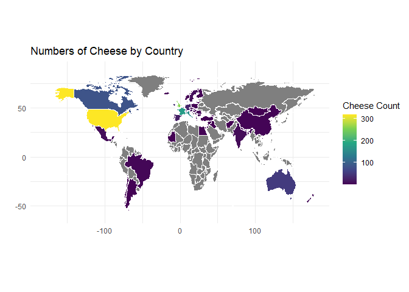

<!-- README.md is generated from README.Rmd. Please edit that file -->

# Tidy Tuesday - National Cheese Day

<!-- badges: start -->
<!-- badges: end -->

This week’s Tidy Tuesday data set is about cheese! 🧀

Cheese.com has information on over 1,000 cheeses from around the world.
This data set includes information on the name, country of origin,
texture, and type of milk used for each cheese.

Tidy Tuesday provided two data tables to work with: `cheeses.csv` and
`cheese_details.csv`. `janitor::compare_df_cols()` was used to compare
the two data sets and determine that `cheese_details.csv` didn’t have
any additional information that I wanted to use that weren’t already
present in `cheeses.csv`.

    #> Rows: 1187 Columns: 19
    #> ── Column specification ────────────────────────────────────────────────────────
    #> Delimiter: ","
    #> chr (17): cheese, url, milk, country, region, family, type, fat_content, cal...
    #> lgl  (2): vegetarian, vegan
    #> 
    #> ℹ Use `spec()` to retrieve the full column specification for this data.
    #> ℹ Specify the column types or set `show_col_types = FALSE` to quiet this message.
    #> Rows: 1187 Columns: 18
    #> ── Column specification ────────────────────────────────────────────────────────
    #> Delimiter: ","
    #> chr (16): url, milk, country, region, family, type, fat_content, calcium_con...
    #> lgl  (2): vegetarian, vegan
    #> 
    #> ℹ Use `spec()` to retrieve the full column specification for this data.
    #> ℹ Specify the column types or set `show_col_types = FALSE` to quiet this message.

<table class="gt_table" data-quarto-disable-processing="false" data-quarto-bootstrap="false">
  <thead>
    <tr class="gt_heading">
      <td colspan="3" class="gt_heading gt_title gt_font_normal gt_bottom_border" style><strong>Comparing Two Dataframes</strong></td>
    </tr>
    &#10;    <tr class="gt_col_headings gt_spanner_row">
      <th class="gt_col_heading gt_columns_bottom_border gt_left" rowspan="2" colspan="1" scope="col" id="Column Name">Column Name</th>
      <th class="gt_center gt_columns_top_border gt_column_spanner_outer" rowspan="1" colspan="2" scope="colgroup" id="Data Source">
        Data Source
      </th>
    </tr>
    <tr class="gt_col_headings">
      <th class="gt_col_heading gt_columns_bottom_border gt_left" rowspan="1" colspan="1" scope="col" id="cheeses.csv">cheeses.csv</th>
      <th class="gt_col_heading gt_columns_bottom_border gt_left" rowspan="1" colspan="1" scope="col" id="cheese_details.csv">cheese_details.csv</th>
    </tr>
  </thead>
  <tbody class="gt_table_body">
    <tr><td headers="column_name" class="gt_row gt_left">alt_spellings</td>
<td headers="raw_cheese" class="gt_row gt_left">character</td>
<td headers="raw_cheese_details" class="gt_row gt_left">character</td></tr>
    <tr><td headers="column_name" class="gt_row gt_left">aroma</td>
<td headers="raw_cheese" class="gt_row gt_left">character</td>
<td headers="raw_cheese_details" class="gt_row gt_left">character</td></tr>
    <tr><td headers="column_name" class="gt_row gt_left">calcium_content</td>
<td headers="raw_cheese" class="gt_row gt_left">character</td>
<td headers="raw_cheese_details" class="gt_row gt_left">character</td></tr>
    <tr><td headers="column_name" class="gt_row gt_left">cheese</td>
<td headers="raw_cheese" class="gt_row gt_left">character</td>
<td headers="raw_cheese_details" class="gt_row gt_left">NA</td></tr>
    <tr><td headers="column_name" class="gt_row gt_left">color</td>
<td headers="raw_cheese" class="gt_row gt_left">character</td>
<td headers="raw_cheese_details" class="gt_row gt_left">character</td></tr>
    <tr><td headers="column_name" class="gt_row gt_left">country</td>
<td headers="raw_cheese" class="gt_row gt_left">character</td>
<td headers="raw_cheese_details" class="gt_row gt_left">character</td></tr>
    <tr><td headers="column_name" class="gt_row gt_left">family</td>
<td headers="raw_cheese" class="gt_row gt_left">character</td>
<td headers="raw_cheese_details" class="gt_row gt_left">character</td></tr>
    <tr><td headers="column_name" class="gt_row gt_left">fat_content</td>
<td headers="raw_cheese" class="gt_row gt_left">character</td>
<td headers="raw_cheese_details" class="gt_row gt_left">character</td></tr>
    <tr><td headers="column_name" class="gt_row gt_left">flavor</td>
<td headers="raw_cheese" class="gt_row gt_left">character</td>
<td headers="raw_cheese_details" class="gt_row gt_left">character</td></tr>
    <tr><td headers="column_name" class="gt_row gt_left">milk</td>
<td headers="raw_cheese" class="gt_row gt_left">character</td>
<td headers="raw_cheese_details" class="gt_row gt_left">character</td></tr>
    <tr><td headers="column_name" class="gt_row gt_left">producers</td>
<td headers="raw_cheese" class="gt_row gt_left">character</td>
<td headers="raw_cheese_details" class="gt_row gt_left">character</td></tr>
    <tr><td headers="column_name" class="gt_row gt_left">region</td>
<td headers="raw_cheese" class="gt_row gt_left">character</td>
<td headers="raw_cheese_details" class="gt_row gt_left">character</td></tr>
    <tr><td headers="column_name" class="gt_row gt_left">rind</td>
<td headers="raw_cheese" class="gt_row gt_left">character</td>
<td headers="raw_cheese_details" class="gt_row gt_left">character</td></tr>
    <tr><td headers="column_name" class="gt_row gt_left">row_id</td>
<td headers="raw_cheese" class="gt_row gt_left">integer</td>
<td headers="raw_cheese_details" class="gt_row gt_left">integer</td></tr>
    <tr><td headers="column_name" class="gt_row gt_left">synonyms</td>
<td headers="raw_cheese" class="gt_row gt_left">character</td>
<td headers="raw_cheese_details" class="gt_row gt_left">character</td></tr>
    <tr><td headers="column_name" class="gt_row gt_left">texture</td>
<td headers="raw_cheese" class="gt_row gt_left">character</td>
<td headers="raw_cheese_details" class="gt_row gt_left">character</td></tr>
    <tr><td headers="column_name" class="gt_row gt_left">type</td>
<td headers="raw_cheese" class="gt_row gt_left">character</td>
<td headers="raw_cheese_details" class="gt_row gt_left">character</td></tr>
    <tr><td headers="column_name" class="gt_row gt_left">url</td>
<td headers="raw_cheese" class="gt_row gt_left">character</td>
<td headers="raw_cheese_details" class="gt_row gt_left">character</td></tr>
    <tr><td headers="column_name" class="gt_row gt_left">vegan</td>
<td headers="raw_cheese" class="gt_row gt_left">logical</td>
<td headers="raw_cheese_details" class="gt_row gt_left">logical</td></tr>
    <tr><td headers="column_name" class="gt_row gt_left">vegetarian</td>
<td headers="raw_cheese" class="gt_row gt_left">logical</td>
<td headers="raw_cheese_details" class="gt_row gt_left">logical</td></tr>
  </tbody>
  &#10;  
</table>

## Cheeses of the World

I wanted to know how many different cheeses were produced in each
country, however the country column in the dataset had anywhere from one
to eight countries listed. We need to create a dataframe that lists the
country and a single country, so cheeses that have multiple countries
listed would lhave multiple rows in the new dataframe.

<!-- -->

The most common types of descriptors for cheese texture in this data set
include creamy, smooth, firm, crumbly, soft.

<table class="gt_table" data-quarto-disable-processing="false" data-quarto-bootstrap="false">
  <thead>
    <tr class="gt_heading">
      <td colspan="2" class="gt_heading gt_title gt_font_normal" style><strong>Most Popular Cheese Descriptions</strong></td>
    </tr>
    <tr class="gt_heading">
      <td colspan="2" class="gt_heading gt_subtitle gt_font_normal gt_bottom_border" style>Number of times each phrase shows up in the data set</td>
    </tr>
    <tr class="gt_col_headings">
      <th class="gt_col_heading gt_columns_bottom_border gt_left" rowspan="1" colspan="1" scope="col" id="Texture">Texture</th>
      <th class="gt_col_heading gt_columns_bottom_border gt_right" rowspan="1" colspan="1" scope="col" id="Number of References">Number of References</th>
    </tr>
  </thead>
  <tbody class="gt_table_body">
    <tr><td headers="texture" class="gt_row gt_left">Creamy</td>
<td headers="count" class="gt_row gt_right">605</td></tr>
    <tr><td headers="texture" class="gt_row gt_left">Smooth</td>
<td headers="count" class="gt_row gt_right">311</td></tr>
    <tr><td headers="texture" class="gt_row gt_left">Firm</td>
<td headers="count" class="gt_row gt_right">249</td></tr>
    <tr><td headers="texture" class="gt_row gt_left">Crumbly</td>
<td headers="count" class="gt_row gt_right">226</td></tr>
    <tr><td headers="texture" class="gt_row gt_left">Soft</td>
<td headers="count" class="gt_row gt_right">125</td></tr>
    <tr><td headers="texture" class="gt_row gt_left">Dense</td>
<td headers="count" class="gt_row gt_right">99</td></tr>
    <tr><td headers="texture" class="gt_row gt_left">Buttery</td>
<td headers="count" class="gt_row gt_right">82</td></tr>
    <tr><td headers="texture" class="gt_row gt_left">Open</td>
<td headers="count" class="gt_row gt_right">80</td></tr>
    <tr><td headers="texture" class="gt_row gt_left">Supple</td>
<td headers="count" class="gt_row gt_right">64</td></tr>
    <tr><td headers="texture" class="gt_row gt_left">Compact</td>
<td headers="count" class="gt_row gt_right">63</td></tr>
    <tr><td headers="texture" class="gt_row gt_left">Spreadable</td>
<td headers="count" class="gt_row gt_right">54</td></tr>
    <tr><td headers="texture" class="gt_row gt_left">Soft-Ripened</td>
<td headers="count" class="gt_row gt_right">48</td></tr>
    <tr><td headers="texture" class="gt_row gt_left">Flaky</td>
<td headers="count" class="gt_row gt_right">40</td></tr>
    <tr><td headers="texture" class="gt_row gt_left">Grainy</td>
<td headers="count" class="gt_row gt_right">38</td></tr>
    <tr><td headers="texture" class="gt_row gt_left">Elastic</td>
<td headers="count" class="gt_row gt_right">29</td></tr>
    <tr><td headers="texture" class="gt_row gt_left">Runny</td>
<td headers="count" class="gt_row gt_right">28</td></tr>
    <tr><td headers="texture" class="gt_row gt_left">Springy</td>
<td headers="count" class="gt_row gt_right">27</td></tr>
    <tr><td headers="texture" class="gt_row gt_left">Dry</td>
<td headers="count" class="gt_row gt_right">23</td></tr>
    <tr><td headers="texture" class="gt_row gt_left">Crystalline</td>
<td headers="count" class="gt_row gt_right">19</td></tr>
    <tr><td headers="texture" class="gt_row gt_left">Brittle</td>
<td headers="count" class="gt_row gt_right">14</td></tr>
    <tr><td headers="texture" class="gt_row gt_left">Chalky</td>
<td headers="count" class="gt_row gt_right">14</td></tr>
    <tr><td headers="texture" class="gt_row gt_left">Fluffy</td>
<td headers="count" class="gt_row gt_right">14</td></tr>
    <tr><td headers="texture" class="gt_row gt_left">Stringy</td>
<td headers="count" class="gt_row gt_right">11</td></tr>
    <tr><td headers="texture" class="gt_row gt_left">Semi Firm</td>
<td headers="count" class="gt_row gt_right">10</td></tr>
    <tr><td headers="texture" class="gt_row gt_left">Chewy</td>
<td headers="count" class="gt_row gt_right">9</td></tr>
    <tr><td headers="texture" class="gt_row gt_left">Close</td>
<td headers="count" class="gt_row gt_right">7</td></tr>
    <tr><td headers="texture" class="gt_row gt_left">Gooey</td>
<td headers="count" class="gt_row gt_right">5</td></tr>
    <tr><td headers="texture" class="gt_row gt_left">Oily</td>
<td headers="count" class="gt_row gt_right">3</td></tr>
    <tr><td headers="texture" class="gt_row gt_left">Sticky</td>
<td headers="count" class="gt_row gt_right">1</td></tr>
  </tbody>
  &#10;  
</table>

<table class="gt_table" data-quarto-disable-processing="false" data-quarto-bootstrap="false">
  <thead>
    <tr class="gt_heading">
      <td colspan="2" class="gt_heading gt_title gt_font_normal" style><strong>Most Popular Milk Types</strong></td>
    </tr>
    <tr class="gt_heading">
      <td colspan="2" class="gt_heading gt_subtitle gt_font_normal gt_bottom_border" style>Number of cheeses using each milk.</td>
    </tr>
    <tr class="gt_col_headings">
      <th class="gt_col_heading gt_columns_bottom_border gt_left" rowspan="1" colspan="1" scope="col" id="Milk Type">Milk Type</th>
      <th class="gt_col_heading gt_columns_bottom_border gt_right" rowspan="1" colspan="1" scope="col" id="Number of Cheeses">Number of Cheeses</th>
    </tr>
  </thead>
  <tbody class="gt_table_body">
    <tr><td headers="milk" class="gt_row gt_left">Cow</td>
<td headers="count" class="gt_row gt_right">777</td></tr>
    <tr><td headers="milk" class="gt_row gt_left">Goat</td>
<td headers="count" class="gt_row gt_right">267</td></tr>
    <tr><td headers="milk" class="gt_row gt_left">Sheep</td>
<td headers="count" class="gt_row gt_right">194</td></tr>
    <tr><td headers="milk" class="gt_row gt_left">Water Buffalo</td>
<td headers="count" class="gt_row gt_right">21</td></tr>
    <tr><td headers="milk" class="gt_row gt_left">Buffalo</td>
<td headers="count" class="gt_row gt_right">10</td></tr>
    <tr><td headers="milk" class="gt_row gt_left">Plant-Based</td>
<td headers="count" class="gt_row gt_right">6</td></tr>
    <tr><td headers="milk" class="gt_row gt_left">Yak</td>
<td headers="count" class="gt_row gt_right">4</td></tr>
    <tr><td headers="milk" class="gt_row gt_left">Camel</td>
<td headers="count" class="gt_row gt_right">1</td></tr>
    <tr><td headers="milk" class="gt_row gt_left">Donkey</td>
<td headers="count" class="gt_row gt_right">1</td></tr>
    <tr><td headers="milk" class="gt_row gt_left">Moose</td>
<td headers="count" class="gt_row gt_right">1</td></tr>
  </tbody>
  &#10;  
</table>

